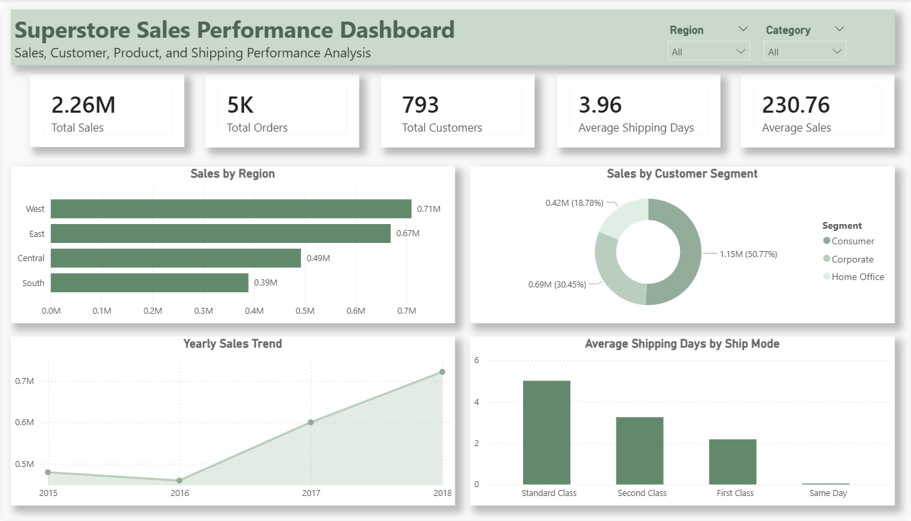
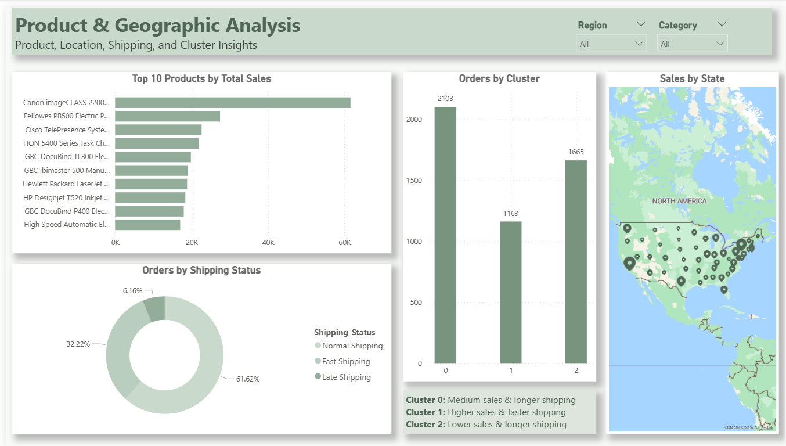

# Superstore Sales Analytics & Machine Learning Project

## Project Overview

This project analyzes Superstore sales data to understand sales performance, customer behavior, product performance, shipping efficiency, and geographic sales distribution.

The project also includes machine learning techniques:
- Classification to predict shipping status.
- Clustering to group orders based on sales and shipping behavior.

## Tools Used

- Python
- Jupyter Notebook
- Pandas
- Matplotlib
- Scikit-learn
- Power BI
- GitHub

## Dataset

The dataset used in this project is the Superstore Sales dataset.  
It contains sales transactions with order details, customer information, product categories, shipping details, regions, and sales values.

## Project Workflow

1. Data loading
2. Data cleaning
3. Feature engineering
4. Exploratory data analysis
5. Machine learning analysis
6. Power BI dashboard development

## Data Cleaning

The dataset was cleaned by:
- Removing unnecessary columns such as `Row_ID`
- Checking and handling missing values
- Removing duplicate records
- Standardizing column names
- Converting date columns into datetime format

## Feature Engineering

New columns were created to support deeper analysis:

- `Order_Year`
- `Order_Month`
- `Order_Month_Name`
- `Shipping_Days`
- `Shipping_Status`
- `Cluster`

These features helped analyze sales trends, shipping performance, and order behavior patterns.

## Exploratory Data Analysis

The analysis focused on answering key business questions:

- Which region generated the highest sales?
- Which customer segment contributed the most to revenue?
- How did sales change over time?
- Which shipping mode had the longest average shipping duration?
- What are the top 10 products by total sales?
- How are sales distributed across states?

## Machine Learning

### Classification

A classification model was built to predict shipping status.

The model achieved an accuracy of **81%**, meaning it correctly predicted the shipping status for 81% of the test data.

### Clustering

K-Means clustering was used to group orders based on:

- Sales
- Shipping Days
- Order Month

The clustering model identified three order behavior groups:

- Cluster 0: Medium sales and longer shipping
- Cluster 1: Higher sales and faster shipping
- Cluster 2: Lower sales and longer shipping

## Power BI Dashboard

The Power BI dashboard contains two pages:

### 1. Executive Summary

This page provides a high-level overview of sales, orders, customers, shipping performance, regional sales, customer segments, and yearly sales trends.

### 2. Product & Geographic Analysis

This page focuses on product performance, geographic sales distribution, shipping status, and order clusters.

## Dashboard Preview

### Executive Summary

### Product & Geographic Analysis

## Key Insights

- The West region generated the highest total sales.
- The Consumer segment contributed the largest share of total sales.
- Sales increased over time, especially in the later years.
- Standard Class had the longest average shipping duration.
- Cluster 1 represented the best-performing order group, with higher sales and faster shipping.
- The top-selling products contributed significantly to total revenue.

## Business Recommendations

- Focus marketing efforts on high-performing regions such as the West region.
- Improve shipping efficiency, especially for slower shipping modes.
- Monitor high-performing products to support better inventory planning.
- Use customer segment insights to create targeted campaigns.
- Use clustering results to better understand different order behavior patterns.

## Project Files

- `Superstore_Sales_Analysis_Machine_Learning.ipynb`  
  Jupyter Notebook containing data cleaning, analysis, and machine learning.

- `Superstore_Sales_Performance_Dashboard.pbix`  
  Power BI dashboard file.

- `Superstore_Sales_Cleaned.csv`  
  Cleaned dataset exported from Python and used in Power BI.

- `images/`  
  Dashboard screenshots.

## Conclusion

This project demonstrates how Python, machine learning, and Power BI can be used together to analyze sales data, discover business insights, and build an interactive dashboard for decision-making.
